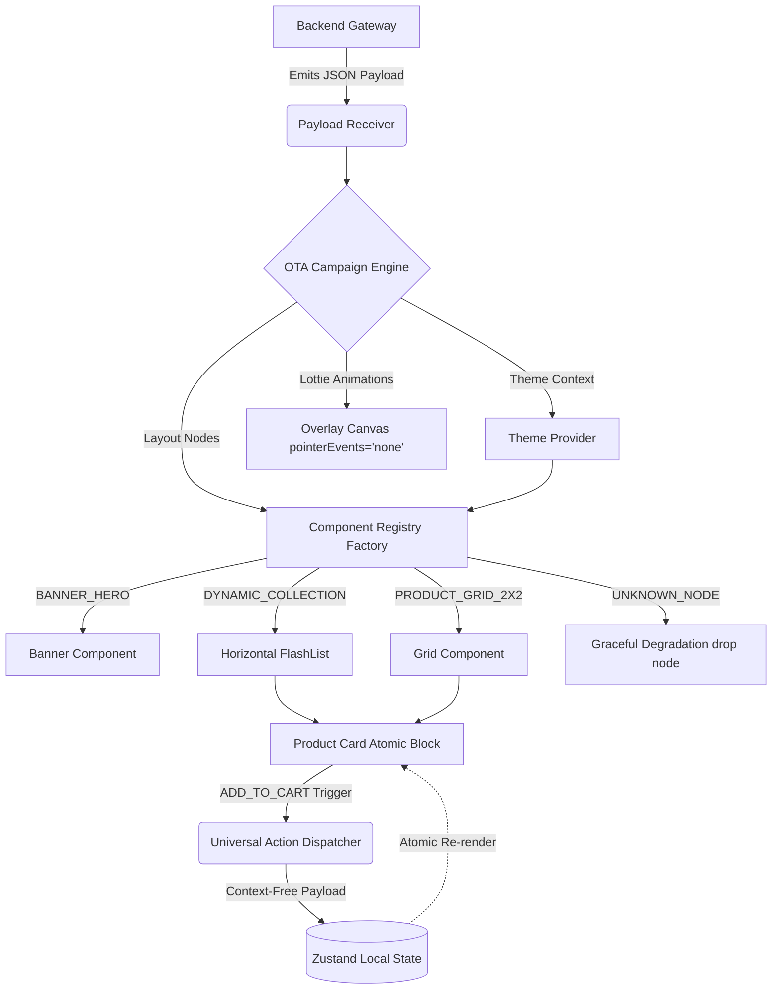

Link to download the file

https://expo.dev/artifacts/eas/0NHB2SL2ElMBxP9ktnZel_a2UU6Ra1JoBOQ0kksmnlk.apk

after downloading file click on open the file it will install the app on your phone sucsessfully


# Kiddo Server-Driven UI (SDUI) Engine

A highly performant, production-ready, configuration-driven React Native homepage renderer built for Kiddo. This engine is designed to handle extremely dynamic live marketing campaigns with zero App Store/Play Store release cycles.

## 🏗 System Design & Architecture Flow

The architecture is built on a unidirectional data flow that dynamically parses backend payloads, applies Over-The-Air (OTA) themes, and maps them to highly optimized UI components.



### Architecture Highlights

#### 1. Component Registry (The Factory Pattern)
The engine ingests a deeply structured JSON payload and uses a scalable Factory Pattern to map backend nodes to active layout definitions (e.g., `BANNER_HERO`, `PRODUCT_GRID_2X2`).
- **Resilient Degradation**: It defensively matches incoming string signatures. If an unsupported node type is encountered, the renderer fails gracefully, dropping the unrecognized node quietly to preserve the total stability of the surrounding view tree.

#### 2. High Frame-Rate Virtualization
The entire operational layout is processed and streamed inside a single, singular vertical `@shopify/flash-list` framework.
- **Dynamic Collections**: The `DYNAMIC_COLLECTION` component instantiates a horizontal `FlatList` nested deep inside the core master vertical feed. It is carefully configured (`directionalLockEnabled`) to ensure that dragging horizontally does not break or drop the vertical velocity momentum of the primary interface list.

#### 3. Local State Collocation (Zero Re-renders)
When a user fires an `ADD_TO_CART` action, the global interface cart increment counter state tracking updates instantly. 
- **The Challenge Solved**: By using **Zustand**, we achieve atomic subscription down to the exact product ID. Mutating the cart selection quantity on one single atomic product card **does not trigger re-renders down the other 30+ layout engine blocks mounted inside the vertical feed**.

#### 4. Over-The-Air (OTA) Remote Overlays & Campaigns
The engine is capable of instantly injecting highly distinct campaign contexts over the air:
- **'Back to School' Mega-Sale**
- **'Summer Playhouse' Festival**
- **'Mystery Gift Carnival'**

This is achieved using a React Context Provider that maps the dynamic structural palette (primary, background) down the tree. Furthermore, we use `lottie-react-native` inside a wrapper with `pointerEvents="none"` to render complex graphic wrapper animations (like Carnival Confetti) cleanly overlapping the full-screen interactive space without input occlusion.

---

## 🛠 Tech Stack
- **Framework:** React Native (Expo)
- **Language:** TypeScript (Strict Mode configured)
- **List Rendering:** `@shopify/flash-list`
- **Animations:** `lottie-react-native`
- **State Management:** `zustand` (Collocated Atomic State)

---

## 📦 How to Run

1. **Install Dependencies**
   ```bash
   npm install
   ```

2. **Start the Engine**
   ```bash
   npx expo start
   ```
   *Press `i` to open iOS simulator, `a` for Android, or scan the QR code with your Expo Go app.*

3. **Test the OTA Campaigns**
   Use the Developer Navigation Row at the top of the app to instantly swap the JSON payloads and see the Theme Context and Lottie Overlays shift immediately without reloading!
